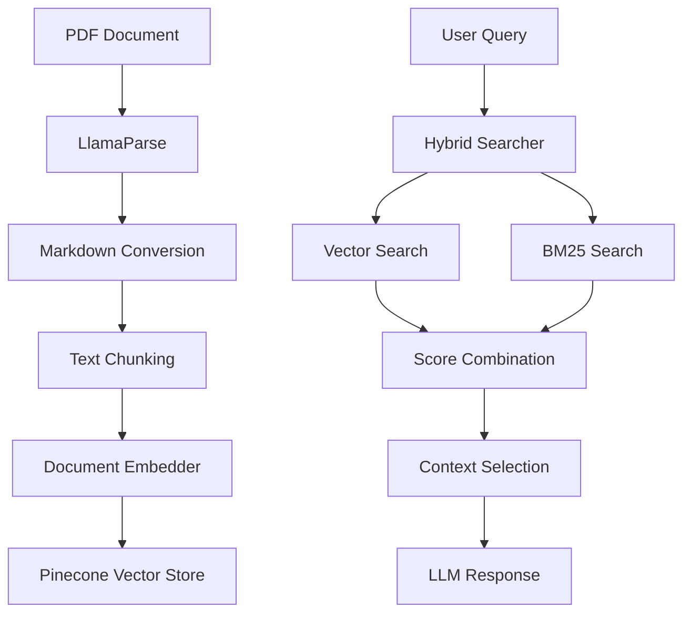
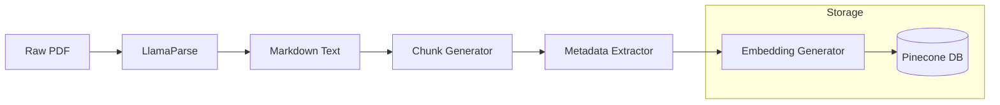
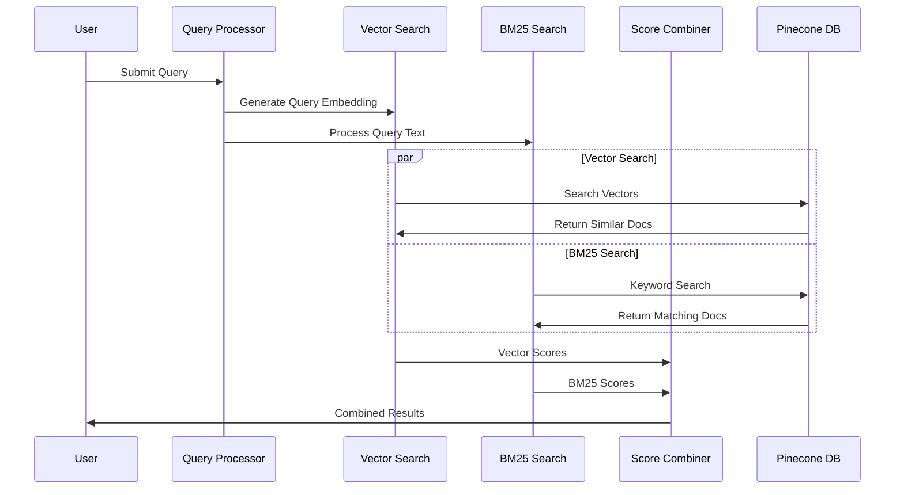

# RAG Implementation with Pinecone and Hybrid Search

## Overview
This project implements a Retrieval-Augmented Generation (RAG) system using Pinecone for vector storage and hybrid search capabilities. The system is specifically optimized for processing and querying financial statements, combining both semantic and keyword-based search approaches.

## System Architecture

### High-Level Flow


### Document Processing Pipeline


### Search Flow


## Key Components

### Document Processing
- LlamaParse integration for PDF to markdown conversion
- Preservation of financial table formatting
- Maintained document hierarchy and structure

```python
document = LlamaParse(result_type="markdown").load_data("financial_statement.pdf")
```

### Document Chunking and Structure
After processing, documents are chunked into the following structure:

```json
{
  "metadata": {
    "last_processed": "2025-02-13 15:35:57",
    "processed_by": "financial-docs-processor",
    "version": "1.0",
    "document_type": "financial_statements"
  },
  "chunks": [
    {
      "id": "section_0_chunk_0",
      "type": "section",
      "content": "## INFOSYS LIMITED AND SUBSIDIARIES Condensed Consolidated Financial Statements under",
      "metadata": {
        "section_title": "## INFOSYS LIMITED AND SUBSIDIARIES",
        "section_type": "financial_statement",
        "sequence": 0
      }
    }
  ]
}
```

### Document Embedding
- Model: SentenceTransformer (all-mpnet-base-v2)
- Normalized embedding generation
- Comprehensive metadata storage
- Sequential document tracking

### Hybrid Search System

#### Vector Search
- Semantic similarity matching
- Embedding-based retrieval
- Cosine similarity metrics

#### BM25 Search
- Statistical keyword matching
- Precise numerical query handling
- Traditional information retrieval

#### Score Combination Algorithm
```python
hybrid_scores = (hybrid_weight * normalized_vector_scores + 
                (1 - hybrid_weight) * normalized_bm25_scores)
```

### Metadata Structure
```json
{
    "content": "document content",
    "section_title": "section name",
    "section_type": "financial_statement",
    "sequence": "document order"
}
```

## Configuration

### Search Parameters
- `k`: Number of retrieved results
- `hybrid_weight`: Vector vs BM25 balance (default: 0.7)
- `similarity_threshold`: Minimum inclusion score (0.3)

## Usage

### Basic Search Example
```python
searcher = HybridSearcher()
results = searcher.search(
    query="What was the revenue growth in Q3?",
    k=3,
    hybrid_weight=0.7
)
```

## Performance Optimizations
- Optimized batch processing (size: 32)
- Score normalization implementation
- BM25 computation caching
- Result deduplication

## Technical Considerations
- Memory-efficient batch processing
- Consistent score normalization
- Caching mechanisms
- Duplicate result handling

## Future Development Roadmap
1. Financial term query expansion
2. Context window optimization
3. Enhanced metadata filtering capabilities
4. Dynamic weight adjustment system

## Implementation Benefits
- Combined semantic and keyword matching
- Preserved document sequencing
- Financial statement optimizations
- Normalized scoring system
- Efficient batch processing

## Requirements
- Python 3.8+
- Pinecone account
- SentenceTransformer
- LlamaParse

## Setup Instructions
1. Install required dependencies
2. Configure Pinecone credentials
3. Initialize document processing pipeline
4. Set up search parameters

Jupyter Notebook Link Here[https://colab.research.google.com/drive/120K6Ks9KCPSsT1yUjnuogRwv0hxpy6Z3?usp=sharing]
